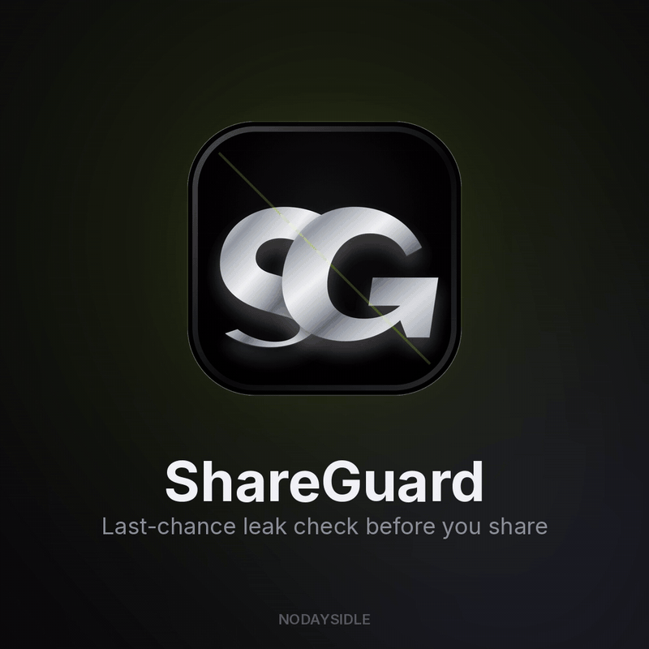

# NODAYSIDLE ShareGuard



> Local-first macOS pre-share privacy scanner.

ShareGuard gives you a last-chance leak check before you publish, send, zip, or push files. Drop in files or folders, scan locally, and review a redacted risk report for secrets, private contact details, local paths, and suspicious share targets.

**v0.1.0** · macOS 14+ · Swift 6 · SwiftUI · no network calls

## Overview

ShareGuard is a pre-share checklist, not a formal DLP guarantee. It runs heuristically on-device with no network calls, no external packages, and no API keys. Findings are masked in the report so screenshots are safer. All scanners operate on local text-like files — no OCR or PDF text extraction in the first slice.

## Features

| Area | Capability |
|------|------------|
| Drag-and-drop scan | Drop files or folders and scan recursively |
| Secret hints | Flags token-like strings, private-key headers, and `.env` values |
| Personal data hints | Flags emails, phone-like strings, local `/Users/` paths, and risky URLs |
| Suspicious files | Calls out filenames such as `id_rsa`, `.pem`, `.p12`, `.mobileprovision`, `.env` |
| Manual-review media | Surfaces PDFs and images as review items instead of pretending OCR exists |
| Redacted findings | Shows short masked excerpts so reports are safer to screenshot |
| Local boundary | No accounts, telemetry, backend, uploads, or cloud sync |

## Detectors

Current first-slice coverage:

- API/token-like strings, including common OpenAI, GitHub, Slack, AWS, and generic patterns
- Private key headers
- `.env` key/value secrets
- Email addresses and phone-like strings
- URLs with query tokens
- Absolute local paths under `/Users/`
- Suspicious filenames: `id_rsa`, `.pem`, `.p12`, `.mobileprovision`, `.env`

Supported text-like inputs: `.md`, `.txt`, `.json`, `.env`, `.env.*`, `.plist`, `.yaml`, `.yml`, `.csv`, `.log`

## Privacy

ShareGuard is intentionally local-first:

- No network calls
- No external Swift packages
- No API keys or accounts
- No telemetry
- No OCR or PDF text extraction in the first slice
- Findings are heuristic and must be reviewed before sharing

## Installation

Download the latest Apple Silicon DMG from [GitHub Releases](https://github.com/nodaysidle/nodaysidle-shareguard/releases/download/v0.1.0-dmg.20260727/ShareGuard-0.1.0.dmg) ([SHA-256 checksum](https://github.com/nodaysidle/nodaysidle-shareguard/releases/download/v0.1.0-dmg.20260727/ShareGuard-0.1.0.dmg.sha256)).

Verify the download:

| Asset | SHA256 |
|-------|--------|
| `ShareGuard-0.1.0.dmg` | `590bd3e066ecd30fa998c38755647264affb571680de6b494055b620a84ce8fd` |

```bash
shasum -a 256 ShareGuard-0.1.0.dmg
```

Open the DMG and drag `ShareGuard.app` to `/Applications`. The app is ad-hoc signed (not Developer ID signed or notarized). On first launch, right-click the app in Finder → **Open**, or allow it in System Settings → Privacy & Security. Developer ID signing and notarization are planned.

The older [v0.1.0 ZIP](https://github.com/nodaysidle/nodaysidle-shareguard/releases/tag/v0.1.0) remains available as a fallback.

## Usage

1. Launch ShareGuard.app
2. Drag files or folders onto the drop zone
3. Review summary cards and redacted findings before sharing

Full operator guide: [USERGUIDE.md](USERGUIDE.md)

## Development

```bash
git clone https://github.com/nodaysidle/nodaysidle-shareguard.git
cd nodaysidle-shareguard
swift build
swift test
./Scripts/package_app.sh
codesign --verify --deep --strict --verbose=2 .build/release/ShareGuard.app
```

Release notes: [CHANGELOG.md](CHANGELOG.md)

## Project Structure

| Path | Purpose |
|------|---------|
| `Sources/ShareGuard/` | Swift app source |
| `Tests/ShareGuardTests/` | XCTest coverage |
| `Scripts/` | Packaging scripts |
| `USERGUIDE.md` | End-user operation guide |
| `CHANGELOG.md` | Release-facing changes |

## Status

Active — v0.1.0. Ad-hoc signed; Developer ID signing and notarization planned.

## Contributing

This repository is not currently accepting external contributions.

## License

Proprietary — Copyright © 2026 NODAYSIDLE. All rights reserved.
